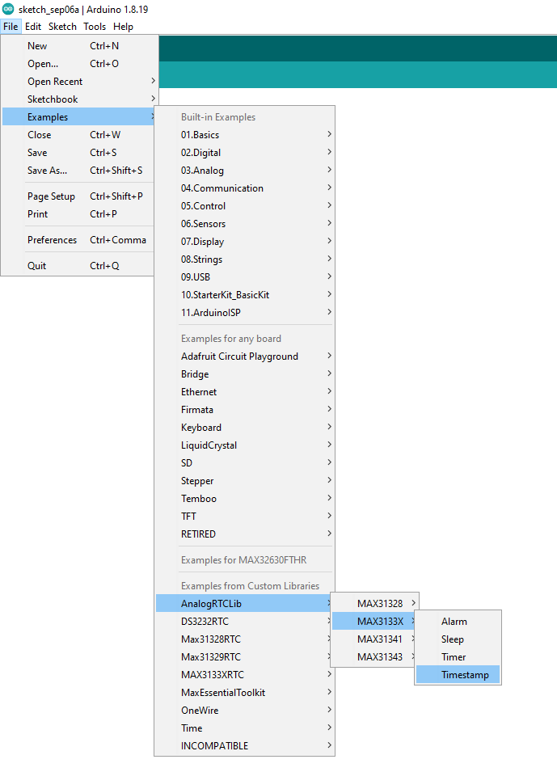
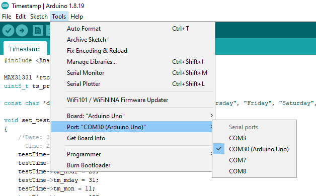
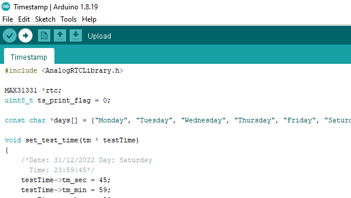
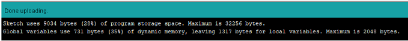

# Analog RTC Lib

AnalogRTCLib package includes arduino driver and usecase examples for MAXIM/ADI RTCs.
Supported part numbers:

- [MAX31331](https://www.maximintegrated.com/en/products/analog/MAX31331.html)
- [MAX31334](https://www.maximintegrated.com/en/products/analog/MAX31334.html)
- [MAX31328](https://www.maximintegrated.com/en/products/analog/real-time-clocks/MAX31328.html)
- [MAX31329](https://www.maximintegrated.com/en/products/analog/real-time-clocks/MAX31329.html)
- [MAX31341](https://www.maximintegrated.com/en/products/analog/real-time-clocks/MAX31341B.html)
- [MAX31343](https://www.maximintegrated.com/en/products/analog/real-time-clocks/MAX31343.html)

## How to install
There are two main options to install library:
### Option 1:
 1. Open Arduino IDE
 2. Go into Tools -> Manage Libraries...
 3. Search for AnalogRTCLib
 4. Click install button

### Option 2: 
 1. Dowload repository as .zip file
 2. Rename .zip file as "AnalogRTCLib.zip" 
 3. Open Arduino IDE
 4. Go into Sketch -> Include Library -> Add .ZIP Library...
 5. Browse the AnalogRTCLib.zip location
 6. Click Open

 ## How to build and load an example
 1. After installation open Arduino IDE
 2. Go into Files -> Examples -> AnalogRTCLib
 3. Select the part number you would like to use
 4. Select an example
 5. (If needs) Update example pin connection in example to it match with your target board.

 

 6. Plug your Arduino board to PC via USB cable.
 7.	Select board type and serial port by navigating to
		Tools->Board
		Tools->Ports

 

 8. Click right arrow button to build and load it

 

 9. Please check output to see whether load succeeded or not
 
 